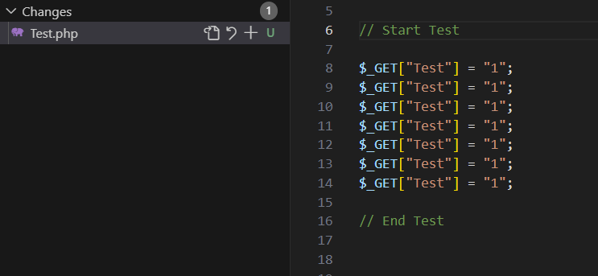

# Examples

#### Set your data

#### Stage changes

## Why

I always mess up by forgetting to comment out test data from my api's before I commit.
So here is my solution.

## What it does

This extension will automaticaly comment out anything for you when you stage your files.

## How it works

Simple!

Add `// Start Test` on top of your test data and add `// End Test` at the end.

Done!

Now when you try to stage your files, anything between those two lines will be commented out.

### Notes

Please do note currently this will only work for php files.
